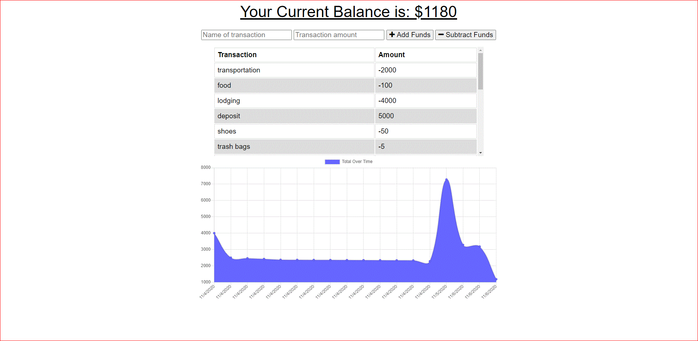

# that-pwa-budget-tracker
Budget tracker application with offline/online access and functionality

## User Story
AS AN avid traveller, I WANT to be able to track my withdrawals and deposits with or without a data/internet connection SO THAT my account balance is accurate when I am traveling. 

## Preview

## Deployed Link
https://fathomless-shelf-95750.herokuapp.com/

## GitHub

https://jen6one9.github.io/that-pwa-budget-tracker/

## Instructions

* Follow these instructions to install a PWA for your specific smartphone OS:

* iOs:

  * 1. Navigate to [https://fathomless-shelf-95750.herokuapp.com/] with Safari.

  * 2. Tap the Share button in Safari.

  * 3. Tap the icon labeled Add to Home Screen.

  * 4. Tap Add in the upper-right corner.

* Android:

  * 1. Navigate to [https://fathomless-shelf-95750.herokuapp.com/] with Chrome.

  * 2. Tap the menu button in the upper right corner of Chrome.

  * 3. Tap the icon labeled Add to Home Screen.

  * 4. Tap Add below the prompt.

## Acknowledgements
The successful release of this application would not be possible with the candid feedback and support of my tutor, class TA's and cohort peers. 

## License 
Copyright 2020 Jeneth Diesta

Permission is hereby granted, free of charge, to any person obtaining a copy of this software and associated documentation files (the "Software"), to deal in the Software without restriction, including without limitation the rights to use, copy, modify, merge, publish, distribute, sublicense, and/or sell copies of the Software, and to permit persons to whom the Software is furnished to do so, subject to the following conditions:

The above copyright notice and this permission notice shall be included in all copies or substantial portions of the Software.

THE SOFTWARE IS PROVIDED "AS IS", WITHOUT WARRANTY OF ANY KIND, EXPRESS OR IMPLIED, INCLUDING BUT NOT LIMITED TO THE WARRANTIES OF MERCHANTABILITY, FITNESS FOR A PARTICULAR PURPOSE AND NONINFRINGEMENT. IN NO EVENT SHALL THE AUTHORS OR COPYRIGHT HOLDERS BE LIABLE FOR ANY CLAIM, DAMAGES OR OTHER LIABILITY, WHETHER IN AN ACTION OF CONTRACT, TORT OR OTHERWISE, ARISING FROM, OUT OF OR IN CONNECTION WITH THE SOFTWARE OR THE USE OR OTHER DEALINGS IN THE SOFTWARE.
